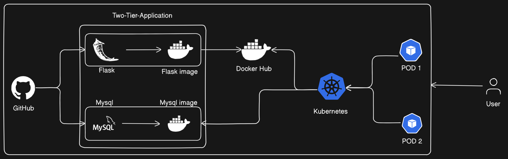
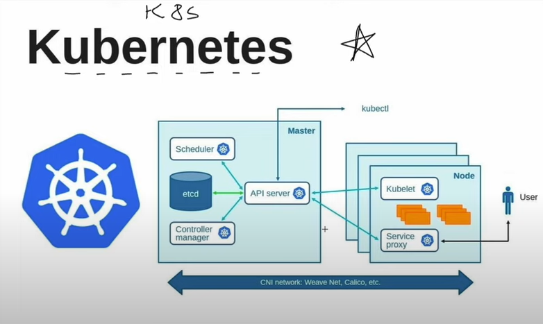
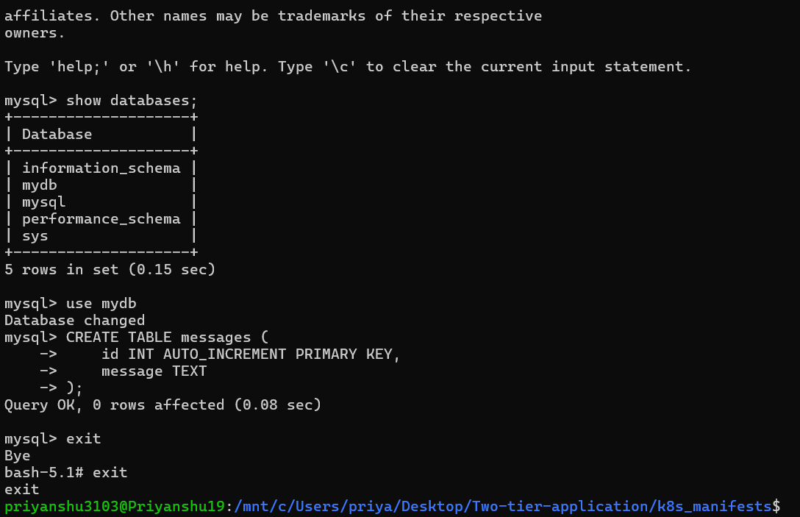

# Deploying a Two-Tier Application on Kubernetes



Deploying a two-tier application on Kubernetes involves setting up two interconnected components, typically a front-end and a back-end, in a Kubernetes cluster. Here is a comprehensive description of the process:

Prerequisites:

Before deploying, ensure the following:

- A Kubernetes cluster is up and running.
- kubectl command-line tool is configured to interact with the cluster.
- Container images for the two tier are stored in a container registry accessible by the cluster.
## Installation

1. Docker Engine

```bash
  sudo apt-get update
  sudo apt-get install ca-certificates curl
  sudo apt-get install docker.io

  #User should have owner of docker
  sudo chown $USER 
```
2. Kubelet Installation for Linux
```bash
  sudo apt-get update
  sudo apt-get install -y apt-transport-https ca-certificates curl
  curl -fsSL https://pkgs.k8s.io/core:/stable:/v1.30/deb/Release.key | sudo gpg --dearmor -o /etc/apt/keyrings/kubernetes-apt-keyring.gpg
  sudo chmod 644 /etc/apt/keyrings/kubernetes-apt-keyring.gpg

  echo 'deb [signed-by=/etc/apt/keyrings/kubernetes-apt-keyring.gpg] https://pkgs.k8s.io/core:/stable:/v1.30/deb/ /' | sudo tee /etc/apt/sources.list.d/kubernetes.list
  sudo chmod 644 /etc/apt/sources.list.d/kubernetes.list

  sudo apt-get update
  sudo apt-get install -y kubectl
  kubectl version --client
```
3. Minikube Installation for Linux
```bash
  curl -LO https://storage.googleapis.com/minikube/releases/latest/minikube_latest_amd64.deb
  sudo dpkg -i minikube_latest_amd64.deb

# Start minikube cluster
  minikube start --nodes 3

# For monitoring the minikube cluster.
  minikube dashboard
```

## Start Deploy

1. Clone the Repository

Clone the repository containing the project files.
```bash
  git clone https://github.com/priyanshu3103/Two-tier-application.git
  cd Two-tier-application
```
2. Build Docker Images
Build the Docker images for the front-end and back-end components. Make sure to replace your-username with your Docker Hub username or your private registry URL.
```bash
# Build flask_app image
  docker build -t priyanshu1979/flask_app:latest

# Build mysql image
  docker build -t mysql:latest
```

3. Push Docker Images to Registry
Push the built images to your container registry.
```bash
# Push flask_app image
docker push priyanshu1979/flask_app:latest
```

4. Update Kubernetes Manifests
```bash
kubectl apply -f two-tier-deployment.yml
kubectl apply -f two-tier-svc.yml
kubectl apply -f mysql-deployment.yml
kubectl apply -f mysql-svc.yml
kubectl apply -f mysql-pv.yml
kubectl apply -f mysql-pvc.yml
```
5. Verify the Deployment
Check the status of your deployments and services.
```bash
# Get the status of deployments
  kubectl get deployments

# Get the status of services
  kubectl get services
```
6. Run minikube services
```bash
  minikube service <flask_app svc name>
```
7. If you facing the error regarding table not exist.so run below commands.
```bash
kubectl get pods

# Specify your mysql pod name below
  kubectl describe pod <pod-name>

# Run this command 
  docker exce -it <mysql_container_id> bash

# After enter in executation mode run this

 mysql -u root -p # enter password that we have specify in manifeste file 

# RUN
  show databases;

  use mydb;

    CREATE TABLE messages (
        id INT AUTO_INCREMENT PRIMARY KEY,
        message TEXT
    );

# After tha you solve table does not exist.
```


## Summary

By following these steps, you can deploy a two-tier Flask and MySQL application on Kubernetes, leveraging Kubernetes' capabilities for scaling, networking, and persistent storage management. Adjust resource limits, use proper configurations, and manage secrets securely to ensure a robust deployment. Powerful features for scaling, networking, and managing persistent storage. Ensure you adjust resource limits, use proper configurations, and securely manage secrets to maintain a reliable and efficient deployment.
